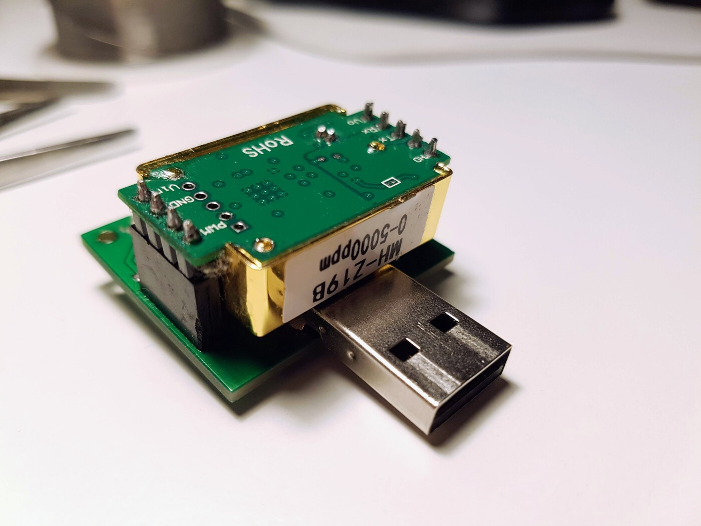

# Carbon Dioxide Sensor MH-Z19b

The carbon dioxide sensor module MH-Z19b is a cheap and very simple sensor with the UART interface allowing concentration measurement in the range up to 5000ppm.

This project is a prototype device using this sensor and built with ESP8266 module.

The hardware design was made with Eagle CAD and available in the directory `eagle`.

The firmware for the device is written using PlatformIO and Arduino platform.